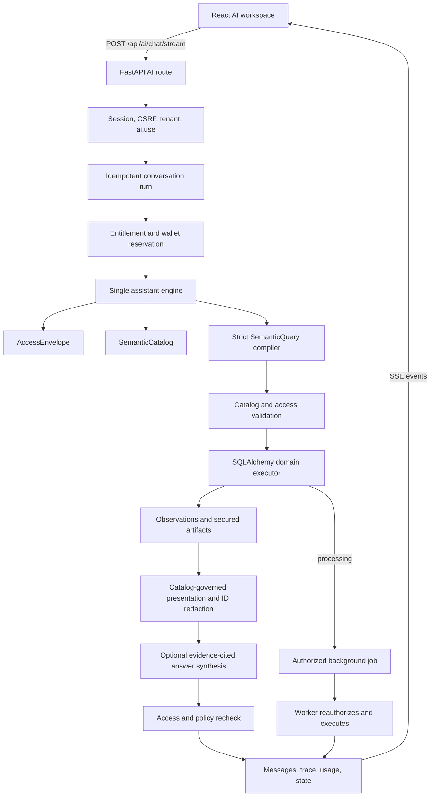

# Edvatiq AI Architecture

This document is the engineering source of truth for the current Edvatiq AI
assistant. It describes the unversioned architecture implemented in
`backend/app/ai`, the `/api/ai` API, the background worker, persistence, and the
React conversation client.

Last verified against the code: 2026-08-19.

## Maintenance contract

An AI change is not complete until this README is updated in the same change.
This applies to changes in any of the following areas:

- assistant contracts, outcomes, goals, artifacts, suggestions, or evidence;
- catalog entities, fields, metrics, analyses, definitions, or aliases;
- compilation, entity resolution, conversation context, or follow-ups;
- RBAC, Owner behavior, entitlements, scope, sensitive fields, or history;
- SQLAlchemy execution, cost limits, pagination, or background jobs;
- model/provider calls, prompts, timeouts, metering, or fallback behavior;
- API routes, SSE events, persistence, actions, or frontend rendering;
- evaluations, performance targets, or known limitations.

Before merging an AI change, complete this checklist:

- Update the relevant design and request-flow sections below.
- Update every affected worked example.
- Update the API, contract, outcome, artifact, and module tables.
- Add or update an executable evaluation or regression test.
- Run the focused backend AI tests and the frontend AI tests.
- Confirm that reduced access cannot increase data exposure.

`backend/tests/test_ai_architecture_readme.py` enforces the parts of this
contract that can be checked mechanically: public goals, outcomes, artifact
types, canonical modules, and AI API routes.

## Architectural purpose

Edvatiq AI is a conversational interface over authorized ERP data. It is not a
database search box, a free-form SQL generator, or an authority for access
decisions.

The architecture follows these invariants:

1. One assistant engine handles every supported industry. There are no local,
   V2, V3, or intent-router execution paths.
2. Natural language is compiled into one strict, non-executable
   `SemanticQuery`.
3. Only identifiers registered in the `SemanticCatalog` may reach execution.
4. The model never writes SQL, selects joins, defines formulas, or grants
   access.
5. Authorization is resolved in application code and applied before entity
   resolution, filtering, joining, aggregation, ranking, and serialization.
6. ERP answers are backed by typed `Observation` evidence. Optional model
   synthesis may only cite observation IDs supplied by execution.
7. Every artifact and suggestion carries security labels and is reauthorized
   when read later.
8. Writes use a separate typed action registry with confirmation,
   reauthorization, idempotency, audit, and bounded undo.
9. Expensive analysis becomes an authorized background job instead of holding
   an interactive request open indefinitely.
10. Subscription entitlements and AI credits are separate from RBAC.
11. Internal database identifiers never enter user-visible prose or field
    values. They remain only in private navigation references, semantic entity
    references, security labels, and interaction controls.

## System overview



## Canonical modules

| Module | Responsibility |
| --- | --- |
| `contracts.py` | Unversioned typed request, query, evidence, response, artifact, suggestion, and conversation-state contracts. |
| `catalog.py` | Approved semantic entities, fields, metrics, permissions, domains, aliases, and analytical capabilities. |
| `compiler.py` | Deterministic interpretation plus one strict Responses API function call when model compilation is needed. |
| `access.py` | Builds the `AccessEnvelope` and enforces module, permission, field, metric, and cross-domain scope rules. |
| `execution.py` | Validates one semantic query, installs the interactive statement timeout, and dispatches to an industry executor. |
| `presentation.py` | Removes internal IDs, repairs student navigation references, and derives typed display metadata only from catalog-approved fields. |
| `engine.py` | Owns the complete turn: scope, compile, execute, synthesize, context update, timeout, and safe fallback. |
| `domains/common.py` | Shared evidence IDs, JSON normalization, and artifact security-label helpers. |
| `domains/college.py` | College profiles, lists, comparisons, rankings, aggregates, trends, eligibility, matching, and descriptive analysis. |
| `domains/business.py` | Shared business client, appointment, and sales execution. |
| `definitions.py` | Organization-configurable, non-executable qualitative thresholds. |
| `provider.py` | The only shared OpenAI model, embedding, OCR, and structured extraction adapter. |
| `actions.py` | Typed, permission-checked, idempotent action preparation, confirmation, execution, and undo. |
| `personalization.py` | Presentation preferences that cannot modify access, facts, or safety behavior. |
| `retrieval.py` | Permission-aware document retrieval used by the separate document-search API. It is not an uncertainty fallback for assistant turns. |
| `record_serializers.py` | Safe serializers used by supported business records. |
| `document_chunking.py` | Structured chunk creation for document ingestion and retrieval. |

Related entry points live outside the package:

| Path | Responsibility |
| --- | --- |
| `backend/app/api/v1/ai.py` | HTTP/SSE transport, conversations, idempotency, wallet handling, persistence, result sessions, views, definitions, actions, feedback, and usage. |
| `backend/app/models/ai.py` | Conversation, turn, message, action, usage, trace, result-session, saved-view, feedback, and semantic-policy tables. |
| `backend/app/worker.py` | Executes `ai_semantic_analysis` jobs with current authorization. |
| `backend/app/services/rbac.py` | Immutable system Owner detection, effective permissions, and Owner health checks. |
| `backend/app/services/access_policy.py` | Enterprise College domain levels and entity scope expansion. |
| `frontend/src/components/ai/AIConversationProvider.jsx` | One active conversation stream, page context, clarification selection, cancellation, action confirmation, and Redux updates. |
| `frontend/src/components/ai/ArtifactCards.jsx` | Shared profile, record, ranking, comparison, and metric card primitives driven by `ArtifactPresentation`. |
| `frontend/src/components/ai/ResponseBlocks.jsx` | Human-first artifact composition, four-card chat previews, three-card compact previews, suggestions, actions, and collapsed evidence. |
| `frontend/src/lib/aiStream.js` | Authenticated SSE transport and typed stream errors. |
| `frontend/src/pages/AIChat.jsx` | Conversation history, messages, artifacts, suggestions, result navigation, and composer states. |

## Public contracts

### AssistantRequest

Each turn contains exactly one of `message` or `interaction`.

```json
{
  "conversation_id": "optional-conversation-id",
  "message": "Show students with CGPA above 8",
  "idempotency_key": "browser-generated-uuid",
  "context": {
    "route": "/app/clients/client-id",
    "entity": {
      "kind": "student",
      "id": "academic-student-id",
      "label": "Lokesh Menon"
    },
    "selected_entities": [],
    "location_id": null,
    "department_id": null,
    "program_id": null,
    "cohort_ids": [],
    "graduation_year": null
  }
}
```

An ambiguity selection is an interaction, not a synthetic prompt:

```json
{
  "conversation_id": "conversation-id",
  "idempotency_key": "new-browser-generated-uuid",
  "interaction": {
    "type": "select_entity",
    "clarification_id": "clarify_...",
    "entity": {
      "kind": "student",
      "id": "canonical-student-id",
      "label": "Kamal Raj"
    }
  }
}
```

### SemanticQuery

`SemanticQuery` is an intermediate representation, not executable code.
Unknown properties are rejected.

```json
{
  "goal": "list",
  "entity": "student",
  "fields": ["id", "name", "cgpa"],
  "metrics": [],
  "filters": [
    {"field": "cgpa", "operator": "gt", "value": 8}
  ],
  "group_by": [],
  "sort": [],
  "entities": [],
  "time_window": null,
  "limit": 25,
  "qualitative_definition": null,
  "requested_analysis": null
}
```

Supported goals are:

| Goal | Meaning |
| --- | --- |
| `profile` | Explain one resolved record. |
| `list` | Return matching authorized records. |
| `compare` | Compare named records or governed groups. |
| `rank` | Order an authorized population by an approved sortable field. |
| `aggregate` | Compute approved metrics, optionally by approved groups. |
| `trend` | Compare reviewed, comparable periods. |
| `correlation` | Report a descriptive association with sample and missingness limits. |
| `eligibility` | Evaluate structured, reviewed eligibility rules. |
| `match` | Compare verified evidence with structured requirements. |
| `analyze` | Run a registered descriptive analysis. |
| `action` | Reserved contract goal; writes currently use the dedicated action API rather than model compilation. |
| `general` | Answer a safe non-ERP question without querying organizational records. |
| `clarify` | Ask for a missing entity, threshold, company, or governed measure. |

Supported filter operators are `eq`, `ne`, `gt`, `gte`, `lt`, `lte`, `in`,
`not_in`, `contains`, and `is_null`.

### Observation

An `Observation` is typed evidence produced by deterministic execution. It can
contain:

- normalized facts;
- a source label and source timestamp;
- sample size and population size;
- evidence coverage;
- definitions used in the calculation;
- an accurate authorized-scope label.

The model cannot create observations. The synthesis model only receives
observations already produced by an executor.

### AssistantResponse

An `AssistantResponse` contains:

- one explicit outcome;
- a conversational answer;
- zero or more optional artifacts;
- zero or more follow-up suggestions;
- zero or more observations;
- the resolved public scope;
- optional result-session and trace identifiers.

### Outcomes

| Outcome | Use |
| --- | --- |
| `success` | A complete authorized answer is available. |
| `partial` | Authorized portions are shown and unavailable projection fields are disclosed. |
| `clarification` | The request needs a record, measure, threshold, company, or selection. |
| `processing` | The authorized analysis exceeded an interactive safety limit and was queued. |
| `empty` | The authorized query ran successfully and matched no records. |
| `not_found` | A named entity could not be found in the caller's authorized scope. |
| `insufficient_evidence` | Data or reviewed definitions are insufficient for a reliable conclusion. |
| `access_limited` | A required permission, College work area, entity scope, or sensitive capability is unavailable. |
| `entitlement_required` | The organization plan does not enable the required module or AI capability. |
| `quota_exhausted` | The organization has no AI credits available for a provider-backed turn. |
| `configuration_required` | A reviewed policy, rule, or structured requirement must be configured first. |
| `unsupported` | The request cannot be represented by the approved catalog. |
| `unavailable` | A provider, timeout, database, worker, or temporary service failure prevented a safe answer. |

### Artifacts

The conversational answer is always primary. Artifacts are optional structured
UI companions.

| Artifact type | Purpose |
| --- | --- |
| `profile` | One resolved entity with permitted fields. |
| `records` | A filtered list with total and pagination metadata. |
| `ranking` | An ordered authorized population with metric definitions and ties. |
| `comparison` | Side-by-side facts or group metrics. |
| `metric` | A governed aggregate or KPI. |
| `chart` | Structured chart data backed by evidence. |
| `sources` | Evidence/source details. |
| `notice` | Scope, missingness, definition, or access information. |
| `clarification` | Canonical entity or measure choices. |
| `action` | A prepared write preview that still requires confirmation. |
| `processing` | A queued background-analysis status. |

Every artifact and suggestion has `ArtifactSecurity` labels:

```json
{
  "permissions": ["college.students.view", "college.assessments.view"],
  "domains": ["assessments", "students"],
  "scope": {"population": 34},
  "entity_ids": ["student-id"],
  "entity_refs": [
    {"kind": "student", "id": "student-id", "label": "Lokesh Menon"}
  ]
}
```

### Presentation and navigation identities

Every artifact also has optional typed `ArtifactPresentation` metadata. It is
derived in `presentation.py` from authorized fields that are both projectable
and marked `visibility="display"` in the semantic catalog.

```json
{
  "layout": "profile",
  "entity": "student",
  "preview_limit": null,
  "fields": [
    {
      "key": "name",
      "label": "Student name",
      "format": "text",
      "group": "Identity",
      "role": "title",
      "priority": 0
    },
    {
      "key": "cgpa",
      "label": "Current CGPA",
      "format": "decimal",
      "group": "Academics",
      "role": "metric",
      "priority": 10
    }
  ]
}
```

The frontend treats `fields` as an allowlist. It does not discover columns by
walking arbitrary artifact objects. Supported display formats are `text`,
`number`, `decimal`, `percent`, `currency_paise`, `date`, `datetime`, `status`,
`relation`, `tags`, `collection`, and `boolean`. Display roles are `title`,
`subtitle`, `badge`, `metric`, `detail`, and `collection`.

The no-internal-ID invariant is enforced at multiple boundaries:

- catalog fields named `id` or ending in `_id` are always internal;
- recursive display sanitization removes storage IDs and private underscore
  fields before synthesis, persistence transport, history, or result pages;
- program, department, and cohort relations contain approved names, codes,
  and business attributes, never their database IDs;
- generated and deterministic prose is UUID-redacted;
- the React renderer suppresses UUID-shaped text as a final fail-closed guard;
- approved identifiers such as admission number, roll number, client number,
  and invoice number remain displayable.

College uses two identities intentionally. The academic
`CollegeStudentProfile.id` is used for semantic referents, conversation state,
RBAC scope, evidence labels, and phrases such as "this student". The linked
`Client.id` is used only by `profile_ref` to navigate to
`/app/clients/{client_id}`. A profile page therefore registers the academic ID
as AI page context while retaining the client ID in the browser route. The UI
renders a profile action only when `profile_ref` resolves to a valid route; it
never renders inert link-styled text.

## End-to-end turn lifecycle

### 1. Frontend request

`AIConversationProvider` creates a UUID idempotency key, appends an optimistic
user message, starts one stream, and sends the current page context to
`POST /api/ai/chat/stream`.

Only one stream may be active in a browser workspace. Changing conversations,
starting a new chat, or pressing Stop cancels the current stream. A canceled
history load is not treated as an API outage; the startup race is retried and
excluded from the global data-health warning.

### 2. Transport and authentication

The SSE request uses the HttpOnly session cookie plus the CSRF token. If the
access cookie expired, the frontend performs one refresh and retries the stream.

The API requires:

- an active authenticated tenant user;
- organization membership;
- effective `ai.use` permission;
- a currently valid `AccessEnvelope`.

The stream emits `accepted`, `status`, `answer_delta`, `artifact`, `suggestion`,
`complete`, or `error` events. A 15-second SSE comment keeps idle connections
alive.

### 3. Idempotent turn creation

The API takes a PostgreSQL advisory transaction lock derived from organization,
user, and idempotency key. `ChatTurn` also has a unique constraint over the same
logical identity.

- A completed duplicate returns the already persisted assistant message.
- An in-progress duplicate returns `409`.
- A failed turn with the same key is cleaned and safely retried.
- An archived conversation cannot receive a new turn until restored.

The user message and processing turn are committed before provider work starts,
so cancellation and failure states remain observable.

### 4. Entitlement and wallet gate

RBAC does not imply subscription access.

- If the AI module is not enabled, the turn returns `entitlement_required`.
- Provider-free greetings and capability questions do not reserve credits.
- Other configured-provider turns reserve a route budget before execution.
- A failed reservation returns `quota_exhausted`.
- The reservation is settled to actual usage or released on failure.

### 5. AccessEnvelope resolution

`resolve_access_envelope()` creates one immutable view of the caller's current
authorization:

- organization and industry;
- enabled modules after entitlements;
- effective permission codes;
- immutable Owner status;
- College domain levels and expanded scopes;
- allowed location IDs and client IDs;
- access-policy version.

The envelope is application state. It is never generated or modified by a
prompt.

### 6. Catalog selection and governed definitions

`catalog_for(industry)` selects the College catalog or shared business catalog.
The engine also loads the organization's safe semantic definitions.

The model sees descriptions, aliases, supported operations, and catalog keys.
It never sees ORM models, table names, storage mappings, joins, permission
decisions, or executable formulas.

### 7. Natural-language compilation

The compiler first builds a deterministic candidate for common, important
patterns such as profiles, thresholds, rankings, attendance, placement,
eligibility, and known follow-ups.

- Greetings, capability questions, and governed clarification cases may finish
  deterministically with no provider call.
- If no provider is configured, supported deterministic ERP candidates can
  still execute.
- With a provider configured, a data turn makes at most one compilation request.
- The compiler requires exactly one strict `submit_semantic_query` function
  call with `parallel_tool_calls: false`.
- Pydantic rejects extra or malformed properties.
- `SemanticCatalog.validate()` rejects unknown or disallowed identifiers.

The model may choose among approved identifiers. It cannot introduce SQL,
database columns, formulas, joins, permissions, or arbitrary analysis names.

### 8. Catalog and authorization validation

Validation occurs again immediately before execution.

`SemanticCatalog` checks:

- the entity exists;
- the goal is allowed for that entity;
- every projected field is projectable;
- every filter is filterable and analytics-safe;
- every sort is sortable and analytics-safe;
- every group is groupable and analytics-safe;
- every metric belongs to the entity;
- every analysis and qualitative definition is registered;
- every referenced entity kind is registered.

`AccessEnvelope` then checks:

- module entitlement;
- entity permission and College domain availability;
- sensitive-field permission;
- permissions/domains for analytical inputs;
- the intersection of every participating College domain scope.

Unavailable projection-only fields may be omitted with `partial`. An
unavailable filter, sort, group, metric, match input, or denominator rejects the
analysis with `access_limited`, because silently removing it would change the
meaning of the result.

### 9. Scope-first SQLAlchemy execution

The executor receives the existing reconciled SQLAlchemy session. It validates
the query and envelope again and installs a PostgreSQL interactive
`statement_timeout` of two seconds.

Industry executors use registered SQLAlchemy expressions and bound values. They
apply tenant and scope predicates before entity resolution, filtering, joining,
aggregation, ranking, or serialization.

Interactive query limits are capped at 100 returned rows. Larger record sets
use opaque, tenant-bound pagination cursors and short-lived result sessions.
Complex analyses have additional row and history safety limits.

### 10. Evidence and deterministic response

Execution creates a complete deterministic answer, observations, artifacts,
and suggestions. This is the authoritative fallback even when model synthesis
is unavailable.

Before the response leaves execution, College student `profile_ref` values are
translated from academic student IDs to tenant-scoped client navigation IDs.
`decorate_response()` then removes internal display fields, strips IDs from
relations and evidence facts, redacts UUID-shaped prose, and attaches
`ArtifactPresentation`. This happens before optional synthesis, persistence,
streaming, history, saved views, and result pagination.

Evidence includes scope labels such as:

- `your organization` for an Owner;
- `your 34 authorized records` for a scoped user.

The executor does not claim institution-wide results when the caller only has a
department, cohort, or student-level population.

### 11. Optional grounded synthesis

For `success` and `partial` responses with observations, the engine may make one
answer request. It requires exactly one strict `submit_answer` function call
with `parallel_tool_calls: false`.

Each answer section must cite at least one observation ID, and every cited ID
must exist in the supplied evidence. An empty, malformed, ungrounded, or timed
out synthesis is discarded. The deterministic evidence-backed answer is used
without a repair model or retry loop.

Synthesis controls wording only. The strict answer tool has no suggestion
output, so the model cannot replace deterministic follow-ups or remove their
canonical entity references and security labels. Presentation preferences are
included as wording guidance, but cannot change facts, access, scope, tools, or
actions. Answers lead with a direct explanation, avoid raw field dumps, and
mention missing evidence only when it matters to the request.

Therefore a normal data turn uses at most:

- one model request to compile;
- one model request to phrase the evidence-backed answer.

Deterministic turns may use zero or one model request. Safe general questions
use a conversational model request but never query ERP data implicitly.

### 12. Authorization race check

Before persistence, the API reloads the user's access version and resolves a
fresh envelope.

If the user became inactive, lost `ai.use`, lost the AI entitlement, or changed
College policy while the answer was being prepared, the data answer is replaced
with `access_limited` or `entitlement_required`. Unverified partial output is not
saved.

### 13. Persistence, metering, and streaming

The completed turn stores:

- user and assistant messages;
- outcome, answer, artifacts, suggestions, evidence, and public scope;
- the validated semantic query;
- current access and policy versions;
- updated ordered conversation state;
- provider usage and wallet charge;
- sanitized execution trace and stage durations;
- audit event.

Only after persistence does the stream emit the final answer, artifacts,
suggestions, and `complete` payload.

The React client renders the conversational answer first. Profile, records,
ranking, comparison, and metric artifacts use responsive cards rather than AI
tables or key-value dumps. Standard chat previews four records and the compact
assistant previews three. `View all N` opens a responsive one-, two-, or
three-column drawer; each authorized page contains at most 25 records by
default. Nested collections render as chips or grouped mini-cards. Evidence and
scope stay in a collapsed secondary panel, and follow-ups appear under "You
could also ask".

### 14. Background analysis

When a registered analysis exceeds its interactive safety limit, execution
returns `processing` and a secured processing artifact. The API queues an
idempotent `ai_semantic_analysis` job.

The worker:

1. reloads the user and original assistant message;
2. verifies tenant, active status, `ai.use`, and current module entitlement;
3. rebuilds the current `AccessEnvelope`;
4. validates the saved `SemanticQuery` again;
5. executes with larger but still bounded background limits;
6. replaces the processing message with the final authorized result;
7. publishes an `/ai` realtime invalidation.

If access was revoked, the stored message becomes `access_limited`. If the
background safety limit is still exceeded, the result becomes `unavailable` and
asks for a narrower population or time range.

## Authorization model

### Owner invariant

An organization Owner is identified only through the active immutable system
role whose `system_key` is `owner`. An editable role name or slug is never used
for Owner detection.

For an active tenant Owner:

- effective permissions include every global and organization permission in
  the current catalog, including permissions added in the future;
- per-user deny overrides are ignored;
- College domain levels resolve to `manage` with unrestricted organization
  scope even if the policy row is missing or corrupt;
- business location and client scope are unrestricted within the organization;
- all enabled organization modules and sensitive capabilities are available;
- cross-tenant data and platform-super-admin powers remain unavailable;
- disabled modules, subscription entitlements, and AI-wallet limits still
  apply;
- write confirmations, access revalidation, idempotency, audit, and undo still
  apply.

Migration `20260817_0040_universal_assistant.py` created/repaired the immutable
Owner roles, grants, assignments, and College policies. `owner_invariant_health`
reports organizations without a fully provisioned active Owner through the
Super Admin health endpoint.

### Non-Owner users

Every non-Owner data request requires the intersection of:

1. organization tenancy;
2. active user status;
3. `ai.use`;
4. enabled subscription module;
5. entity/module permission;
6. College domain level where applicable;
7. location, client, department, program, cohort, course-offering, or student
   reach;
8. field-level sensitive permission where applicable.

College scopes are independent by domain: students, academics, assessments,
attendance, readiness, coding, placements, documents, clearance, reports, and
data administration. Cross-module analysis intersects student reach across all
participating domains.

For example, "high CGPA but unplaced" requires both assessments and placements.
The candidate population is the intersection of students visible in those
domains. If either analytical input is unavailable, the assistant does not
compute a misleading partial ranking.

### Information-disclosure behavior

- An out-of-scope named record returns `not_found`, which does not reveal that
  the record exists elsewhere.
- A missing module/domain permission returns `access_limited`.
- A plan-disabled module returns `entitlement_required`.
- Sensitive contact fields can be omitted from a profile with `partial`.
- Sensitive or unavailable fields cannot be used to filter, rank, group, match,
  or calculate a denominator.
- Protected administrative attributes are not registered as ranking,
  readiness, matching, or placement-analysis inputs.

## Conversation and entity resolution

### Ordered referents

`ConversationState` stores at most 20 deduplicated referents from:

- explicit page context;
- a clarification selection;
- an explicitly named message;
- a returned profile.

The state also stores one pending clarification, the last semantic query, and
the policy version.

### Rules for follow-ups

- "this student" uses an explicit page entity or one unambiguous recent student
  referent.
- "these two" requires two explicit student referents.
- A newly named person always replaces stale person context.
- A new class, department, year, group, ranking, or population question does
  not inherit a prior student.
- Opening a profile supplies page context; it does not send a synthetic prompt.
- Choosing an ambiguity option resumes the original saved semantic query with
  a canonical entity ID.
- A stale or forged clarification ID is rejected.

### Entity matching

Entity resolution runs only inside the caller's authorized scope. It supports
exact and typo-tolerant matching for registered entity kinds. A unique match
continues. Multiple plausible matches return a `clarification` artifact. No
match returns `not_found`.

## Semantic catalogs

### College

The College catalog currently registers these entities:

| Entity | Main governed capabilities |
| --- | --- |
| `student` | Identity, structure, CGPA/SGPA, academic history, attendance, readiness, skills, projects, certifications, internships, training, coding, placement status, eligibility, matches, offers, packages, and subject performance. |
| `department` | Department-level structure and translated student-population aggregates. |
| `cohort` | Class, cohort, batch, and section structure and translated student-population aggregates. |
| `company` | Selection counts/rates, eligible counts, packages, structured requirements, recruiting and company comparisons. |
| `subject` | Published assessment averages, failure rates, subject attendance, student counts, group comparison, and trends. |

Registered College metrics include `student_count`, `average_cgpa`,
`average_attendance`, `placement_rate`, `average_package`, `readiness_score`,
`average_skill_count`, `certification_total`, `internship_participation_rate`,
`subject_average`, `failure_rate`, `subject_attendance`,
`company_selection_count`, `company_selection_rate`, and
`company_average_package`.

Registered analyses cover governed subject comparisons and trends, attendance
changes, academic changes, readiness changes, eligibility, structured company
matching, placement skill frequencies, offer details, company selection rates,
and historical placement-success associations.

### Shared business industries

Gym, salon, clinic, and other non-College workspaces currently share these
registered entities:

| Entity | Main governed capabilities |
| --- | --- |
| `client` | Authorized profiles and lists. |
| `appointment` | Authorized appointment lists by time, status, client, and location. |
| `sale` | Authorized invoice records and finalized revenue aggregates. |

Registered business metrics are `client_count`, `appointment_count`, and
`revenue`.

Adding a new industry capability means extending this catalog and its domain
executor. It does not mean creating another assistant version or intent router.

## Governed qualitative definitions

Organization administrators with `roles.manage` and `ai.use` can update safe
numeric definitions through the definitions API. They cannot store SQL,
expressions, prompt fragments, joins, or executable formulas.

| Definition | Default |
| --- | ---: |
| Low attendance | below 75% |
| Severe attendance | below 60% |
| Consistent attendance | at least 90% across 3 periods |
| Sudden attendance drop | 10 percentage points |
| High CGPA | 8.0 |
| Subject weakness | pass mark or 50% fallback |
| Improvement window | latest 2 comparable periods |
| Overall good student | active placement-readiness policy |
| Minimum association sample | 20 |

"Overall good student" is intentionally not a model opinion. It ranks by the
active reviewed placement-readiness policy, enforces evidence coverage, and
discloses ties and scope.

"Who is best?" is not governed because the measure is missing. It returns a
clarification offering CGPA, placement readiness, attendance, or another
approved measure.

## Worked query examples

The JSON below is intentionally abridged to the fields that explain each flow.
The real contract always contains all `SemanticQuery` properties.

### Example 1: named student profile

User:

```text
Who is Lokesh Menon?
```

Compilation:

```json
{
  "goal": "profile",
  "entity": "student",
  "fields": [
    "id", "name", "admission_number", "program", "department", "cohort",
    "graduation_year", "cgpa", "attendance_percent", "readiness_score",
    "placement_status", "skills", "projects", "certifications"
  ],
  "entities": [
    {"kind": "student", "id": null, "label": "Lokesh Menon"}
  ]
}
```

What happens:

1. Student, assessment, attendance, readiness, and placement field permissions
   are evaluated independently.
2. Entity resolution searches only authorized students.
3. A unique match is converted to the canonical student ID.
4. The profile executor loads each permitted evidence domain.
5. Missing optional modules are omitted and the outcome becomes `partial`.
6. The answer explains Lokesh; the profile artifact is not a generic search
   result.
7. The academic student ID remains in the artifact security label and ordered
   conversation referent, while `profile_ref` receives Lokesh's linked client
   ID for navigation.
8. Presentation decoration removes relation IDs and exposes only catalog
   display fields.

An abridged result looks like this:

```json
{
  "answer": "Lokesh Menon is currently marked active and studies B.Sc. Computer Science in the Class of 2026, Section A. The available academic record shows a current CGPA of 7.03 and 84% attendance. For placements, the record shows a readiness score of 60.23 and a current status of unplaced.",
  "artifacts": [
    {
      "type": "profile",
      "title": "Lokesh Menon",
      "data": {
        "name": "Lokesh Menon",
        "admission_number": "COL-2023-0080",
        "status": "active",
        "program": {
          "code": "BSC-CS",
          "name": "B.Sc. Computer Science"
        },
        "department": {
          "code": "CSE",
          "name": "Computer Science and Engineering"
        },
        "cgpa": 7.03,
        "attendance_percent": 84,
        "profile_ref": {
          "kind": "client",
          "id": "private-client-navigation-id"
        }
      },
      "presentation": {
        "layout": "profile",
        "entity": "student",
        "fields": [
          {"key": "name", "label": "Student name", "format": "text", "group": "Identity", "role": "title", "priority": 0},
          {"key": "program", "label": "Program", "format": "relation", "group": "Enrollment", "role": "subtitle", "priority": 10},
          {"key": "cgpa", "label": "Current CGPA", "format": "decimal", "group": "Academics", "role": "metric", "priority": 10}
        ]
      }
    }
  ]
}
```

The client renders the narrative as the primary answer, followed by an
insight-first profile card. It displays `B.Sc. Computer Science (BSC-CS)` and
`Computer Science and Engineering (CSE)`, never their UUIDs. "Open full
profile" is a real keyboard-accessible link to `/app/clients/{client_id}`.

If two authorized students match, the assistant asks the user to choose. The
selection resumes this exact profile query.

### Example 2: ambiguity selection without a fake prompt

User:

```text
What is Kamal's CGPA?
```

Assume two authorized Kamal records match. The first result is:

```json
{
  "outcome": "clarification",
  "answer": "I found more than one authorized student with that name. Choose one and I'll continue your original question.",
  "artifacts": [
    {
      "type": "clarification",
      "data": {
        "clarification_id": "clarify_...",
        "options": [
          {
            "entity": {
              "kind": "student",
              "id": "student-7",
              "label": "Kamal Raj"
            }
          }
        ]
      }
    }
  ]
}
```

Clicking Kamal Raj sends `interaction.type = select_entity`. The engine verifies
the clarification ID and allowed entity ID, inserts `student-7` into the saved
query, and answers the original CGPA question. It never creates "Tell me about
Kamal Raj" as a new prompt.

### Example 3: stale context is ignored for a population ranking

Conversation turn 1:

```text
Who is Lokesh Menon?
```

Conversation turn 2:

```text
Tell me about the overall good student of 2026.
```

Compilation of turn 2:

```json
{
  "goal": "rank",
  "entity": "student",
  "fields": [
    "id", "name", "graduation_year", "readiness_score",
    "readiness_band", "readiness_coverage"
  ],
  "filters": [
    {"field": "graduation_year", "operator": "eq", "value": 2026}
  ],
  "sort": [
    {"field": "readiness_score", "direction": "desc"}
  ],
  "entities": [],
  "limit": 10,
  "qualitative_definition": "overall_good_student"
}
```

The new year-scoped population language clears person inheritance. Lokesh does
not become the best student merely because the previous turn mentioned him.

### Example 4: filtered list

User:

```text
Show students with CGPA above 8.
```

Compilation:

```json
{
  "goal": "list",
  "entity": "student",
  "fields": ["id", "name", "cgpa"],
  "filters": [
    {"field": "cgpa", "operator": "gt", "value": 8}
  ],
  "limit": 25
}
```

Required authorization includes `college.students.view`,
`college.assessments.view`, and the intersection of students visible in the
students and assessments domains. A user without assessments access receives
`access_limited`; the assistant does not return names while silently ignoring
the CGPA filter.

### Example 5: follow-up from explicit page context

The student profile page registers:

```json
{
  "entity": {
    "kind": "student",
    "id": "student-80",
    "label": "Lokesh Menon"
  }
}
```

User:

```text
What is this student's current CGPA?
```

Compilation uses the canonical page entity:

```json
{
  "goal": "profile",
  "entity": "student",
  "fields": ["id", "name", "cgpa"],
  "entities": [
    {"kind": "student", "id": "student-80", "label": "Lokesh Menon"}
  ]
}
```

If no explicit or unambiguous referent exists, the outcome is `clarification`
instead of guessing a student.

### Example 6: compare two selected students

User selects two student cards and asks:

```text
Who has the higher CGPA between these two students?
```

Compilation:

```json
{
  "goal": "compare",
  "entity": "student",
  "fields": ["id", "name", "cgpa"],
  "entities": [
    {"kind": "student", "id": "student-a", "label": "Asha"},
    {"kind": "student", "id": "student-b", "label": "Bala"}
  ]
}
```

Both students must remain in the caller's current assessment scope. The
comparison artifact cites the same observations used by the conversational
answer.

### Example 7: eligibility and structured matching

User:

```text
Which unplaced students are eligible for packages at least INR 10 LPA?
```

Relevant compilation shape:

```json
{
  "goal": "eligibility",
  "entity": "student",
  "fields": [
    "id", "name", "placement_status", "eligible_company_count"
  ],
  "filters": [
    {"field": "placement_status", "operator": "eq", "value": "unplaced"},
    {
      "field": "opportunity_package_max",
      "operator": "gte",
      "value": 100000000
    }
  ],
  "requested_analysis": "current_opportunity_eligibility"
}
```

The package threshold applies to current opportunity packages, not historical
student offers. Eligibility uses reviewed structured opportunity rules such as
CGPA, backlogs, attendance, solved problems, skills, clearance, program,
department, cohort, and graduation year. Missing required evidence is reported;
the model cannot invent eligibility.

For "best match for this company," a company must be named or explicitly
selected. Structured requirements are compared with verified student evidence.
Missing requirements produce `insufficient_evidence` or
`configuration_required`.

### Example 8: ambiguous qualitative language

User:

```text
Who is best?
```

Compilation:

```json
{
  "goal": "clarify",
  "entity": "student",
  "requested_analysis": "ambiguous_best"
}
```

Response:

```text
'Best' can mean different things. Choose CGPA, placement readiness,
attendance, or tell me another approved measure.
```

No search is executed, and no previous student context is reused.

### Example 9: historical association, not prediction

User:

```text
Analyze our placement data and tell me what factors appear to contribute most
to successful placements.
```

Compilation selects `analyze` with the registered
`placement_success_associations` analysis. Execution requires placement access
and any evidence domains used in the comparison. It reports sample size,
coverage, missingness, and descriptive differences between historical groups.

The answer must say that the result is an association, not causation. It does
not produce an employment probability or guarantee an outcome.

Similarly, "most likely to succeed" is translated to explainable placement
readiness and evidence coverage, not a predictive employment score.

### Example 10: expensive trend becomes a job

User:

```text
Which students have shown a sudden drop in attendance?
```

The query uses `trend` plus the governed 10-percentage-point sudden-drop
definition. If the authorized period history exceeds the interactive safety
limit, the immediate response is:

```json
{
  "outcome": "processing",
  "answer": "This trend exceeds the interactive population limit and has been queued for authorized background analysis.",
  "artifacts": [
    {"type": "processing", "data": {"job_id": "...", "status": "queued"}}
  ]
}
```

The worker later reauthorizes and updates that same assistant message.

### Example 11: safe general question

User:

```text
How does machine learning work?
```

This is a `general` assistant question. It can receive a conversational answer,
but the engine does not search students, documents, or the public web as an
uncertainty fallback. The answer cannot claim organization-specific facts.

### Example 12: projection-only partial answer

A staff member may view student academics but not student contact details.

User:

```text
Show the complete profile of this student.
```

The profile can return academics, attendance, readiness, and placement fields
that are authorized while omitting email and phone. The outcome is `partial`
and the answer states that unavailable fields were omitted.

If email were used as a ranking, filter, group, match input, or denominator,
the entire analytical request would return `access_limited` instead.

## Evidence rules for College intelligence

- CGPA and SGPA come from published academic records, not model estimates.
- Attendance uses governed snapshots and comparable periods.
- Skills, projects, certifications, internships, and training use verified
  structured evidence records.
- Readiness uses the active reviewed readiness policy and reports coverage.
- Skill and project counts measure evidence breadth, not invented quality.
- Eligibility uses reviewed opportunity rules and structured requirements.
- Matching reports rule coverage and missing evidence.
- Placement-success analysis reports historical associations only.
- Drive attendance is not inferred from an application.
- Rejection reasons are not inferred when no reviewed categorical field exists.
- Missing data produces `insufficient_evidence`, `configuration_required`, or a
  disclosed partial result rather than fabrication.

## History, result sessions, and saved views

### Conversation history

Conversations are private to their tenant user and expire according to the
configured retention period, defaulting to 90 days. They can be searched,
pinned, renamed, archived, restored, or deleted.

When an assistant message is read, the API reauthorizes:

- the saved semantic query;
- current module entitlement;
- current permissions and sensitive fields;
- current College domain levels and entity reach;
- artifact and suggestion security labels;
- access and policy versions.

Authorized reads also validate each stored artifact against the current
contract, repair historical College student links to client navigation IDs,
rerun catalog presentation decoration, scrub relation/storage IDs, and redact
UUID-shaped answer or suggestion text. Presentation metadata is returned in
conversation history exactly as it is in live streams.

If an aggregate scope changed, the old answer is hidden rather than relabeled.
The user sees: "This historical answer is no longer available under your
current access. Ask again for a freshly authorized answer."

Historical legacy blocks without complete security labels fail closed.

### Result sessions

Large records/ranking artifacts can create a two-hour `AIResultSession`. Every
page reruns the saved validated query through the caller's current
`AccessEnvelope`; rows are not served from an old unrestricted snapshot.

Pagination cursors are opaque, signed to their purpose, filters, and tenant,
and limited to 100 rows per API page. The AI drawer requests 25 authorized
records at a time and receives the artifact title, scope label, and current
`ArtifactPresentation` with every page.

### Saved views

Saved views persist only validated `SemanticQuery` specifications. Running a
view reauthorizes and re-executes it. Team sharing requires both the
`ai.views.share` permission and plan entitlement. Only the view owner can edit
or deactivate it, with optimistic version checks. Saved-view results use the
same card presentation and ID sanitization as live turns and result sessions.

## AI-assisted writes

Data questions never mutate ERP records. Writes use `POST /api/ai/actions/prepare`
and the action registry.

Currently registered actions are:

| Action | Required permission | Additional safeguards |
| --- | --- | --- |
| `create_task` | `dashboard.view` | Typed payload, confirmation, audit, undo. |
| `create_client` | `clients.manage` | Plan limit, location scope, confirmation, audit, safe deactivation undo. |
| `schedule_appointment` | `appointments.manage` | Location/client scope, time validation, conflict check, cancellation undo. |
| `assign_trainer` | `gym.coaching.manage` | Client/employee scope and confirmation. |
| `check_in` | `gym.attendance.mark` | Active membership, location scope, duplicate-open-visit check, bounded undo. |
| `send_message` | `notifications.send` | WhatsApp consent, phone, high-risk confirmation, idempotent queued delivery. |

Action flow:

1. Require `ai.actions`, action permission, and plan entitlement.
2. Validate an extra-forbidden typed payload.
3. Save a preview, access version, policy version, and hashed 10-minute
   confirmation token.
4. On confirmation, recheck permission and policy versions.
5. Execute once under an organization-scoped idempotency key.
6. Audit the mutation.
7. Offer a 30-second undo only when a safe undo implementation exists.

An Owner has all organization permissions but does not bypass any of these
write safeguards.

## Provider, timeouts, and fallback

All model calls go through `OpenAIProvider` in `provider.py`.

Interactive calls use the Responses API with:

- `store: false`;
- `parallel_tool_calls: false`;
- no hidden SDK retry/backoff;
- strict function schemas for compilation and synthesis;
- shared HTTP clients;
- explicit token accounting.

Current defaults:

| Setting | Default |
| --- | --- |
| `AI_MODEL_BASIC` | `gpt-5.4-mini` |
| `AI_MODEL` | value of `AI_MODEL_BASIC` |
| `AI_COMPILE_TIMEOUT_SECONDS` | 8 seconds |
| `AI_ANSWER_TIMEOUT_SECONDS` | 9 seconds |
| `AI_INTERACTIVE_DEADLINE_SECONDS` | 25 seconds maximum |
| PostgreSQL interactive statement timeout | 2 seconds |
| `AI_EMBEDDING_MODEL` | `text-embedding-3-small` |

Failure policy:

- Compilation schema/catalog failure returns `unsupported`.
- Synthesis timeout or invalid citations uses the deterministic answer.
- The 25-second turn deadline returns `unavailable` and saves no partial,
  unverified answer.
- Unexpected failures return `unavailable` without exposing internals.
- Client cancellation marks the turn canceled and releases reserved credits.
- No planner-repair loop, synthesis-repair loop, web fallback, or document
  fallback runs.

## Documents and public web

Document ingestion, chunking, embeddings, and permission-aware retrieval still
exist for the dedicated Documents module and document search API.

The conversational assistant does not search documents or the public web merely
because an ERP query is uncertain. This prevents an authorized-data question
from silently changing into a different evidence source.

If document-grounded assistant answers are added later, document entities,
fields, permissions, citation contracts, and source-selection behavior must be
registered explicitly in the catalog and documented here first.

## Persistence and observability

| Table/model | Stored purpose |
| --- | --- |
| `ChatConversation` | Tenant/user conversation metadata, retention, archive/pin state, and ordered context. |
| `ChatTurn` | Idempotent processing/completed/failed/canceled request lifecycle. |
| `ChatMessage` | Answer, outcome, artifacts, suggestions, evidence, scope, semantic query, and security versions. |
| `AIAction` | Typed write preview, token hash, versions, result, and undo state. |
| `AIUsage` | Provider tokens, requests, route, latency, provider cost, and credits. |
| `AIExecutionTrace` | Sanitized query route, outcome, scope, stage durations, usage, latency, and zero-credit status. |
| `AIResultSession` | Short-lived validated query for current-access pagination. |
| `AISavedView` | Private or team semantic query and layout. |
| `AIMessageFeedback` | Helpful/not-helpful feedback and optional reason. |
| `AISemanticPolicy` | Versioned organization definitions with no executable code. |

Execution traces do not store provider chain-of-thought. They store sanitized
semantic plans, scope, outcomes, timings, and usage needed for operations and
evaluation.

## API surface

All routes require the authenticated tenant boundary. Unless stated otherwise,
they also require `ai.use` through `require_ai_access`.

| Endpoint | Purpose |
| --- | --- |
| `GET /api/ai/conversations` | Legacy bounded conversation list. |
| `GET /api/ai/conversations/page` | Cursor-paginated active, archived, or searched conversations. |
| `GET /api/ai/conversations/{cid}` | Current user's conversation metadata. |
| `GET /api/ai/conversations/{cid}/messages` | Legacy bounded authorized message history. |
| `GET /api/ai/conversations/{cid}/messages/page` | Cursor-paginated and freshly reauthorized messages. |
| `PATCH /api/ai/conversations/{cid}` | Rename, pin, archive, or restore a conversation. |
| `POST /api/ai/chat` | Non-streaming assistant turn. |
| `POST /api/ai/chat/stream` | SSE assistant turn used by the React client. |
| `GET /api/ai/results/{session_id}` | Reauthorized result-session page. |
| `POST /api/ai/results/run` | Run a validated semantic query page under current access. |
| `GET /api/ai/views` | List private and visible team saved views. |
| `POST /api/ai/views` | Create a validated saved view. |
| `PATCH /api/ai/views/{view_id}` | Version-checked saved-view update. |
| `DELETE /api/ai/views/{view_id}` | Soft-delete a saved view. |
| `POST /api/ai/views/{view_id}/run` | Reauthorize and execute a saved view. |
| `GET /api/ai/definitions` | Read effective qualitative definitions and version. |
| `PUT /api/ai/definitions` | Update safe definitions; requires `roles.manage` and `ai.use`. |
| `GET /api/ai/actions` | List the user's actions; requires `ai.actions`. |
| `POST /api/ai/actions/prepare` | Validate and prepare a confirmable action. |
| `POST /api/ai/actions/{action_id}/confirm` | Reauthorize and execute a pending action. |
| `POST /api/ai/actions/{action_id}/confirmation` | Rotate a pending confirmation token. |
| `POST /api/ai/actions/{action_id}/undo` | Run a registered safe undo within its window. |
| `POST /api/ai/messages/{message_id}/feedback` | Store helpful/not-helpful feedback. |
| `GET /api/ai/usage` | Current-month usage grouped by route; requires `billing.view`. |
| `DELETE /api/ai/conversations/{cid}` | Delete one owned conversation. |
| `DELETE /api/ai/conversations/{cid}/turns/{turn_id}` | Delete one owned turn and its messages. |

## Extending the assistant safely

### Add a field

1. Register one `FieldDefinition` in `catalog.py`.
2. Set its domains, permissions, projection/filter/sort/group capabilities,
   sensitive permission, analytics safety, display format, display group,
   display role, display priority, and visibility explicitly.
3. Add the approved SQLAlchemy expression and serializer to the relevant
   domain executor.
4. Add evidence source, timestamp, coverage, and artifact security labels.
5. Add compilation examples/aliases only if natural-language coverage needs
   them.
6. Add Owner, broad staff, scoped staff, missing-domain, and missing-sensitive
   tests.
7. Update this README.

An ORM/database field that is not registered remains inaccessible to the
assistant. A registered field marked `internal` remains available only for
semantic execution and cannot enter an artifact presentation allowlist.

### Add a metric

1. Register one `MetricDefinition` with entity, domains, permissions,
   definition, minimum sample, display format, and display priority.
2. Implement the deterministic calculation in the domain executor.
3. Define the authorized denominator and missing-data behavior.
4. Include sample, population, coverage, definition, and source evidence.
5. Add scope-monotonicity and denominator tests.
6. Update this README.

### Add an analysis

1. Register the analysis name in the catalog.
2. Define required entities, fields, domains, permissions, samples, and safety
   limits in code.
3. Implement it with scope-first SQLAlchemy queries.
4. Decide `empty`, `insufficient_evidence`, `configuration_required`,
   `processing`, and `unavailable` behavior explicitly.
5. Add deterministic and provider-compiled evaluations.
6. Update this README.

### Add an industry entity

1. Add the entity and fields to the industry's catalog.
2. Add one domain-executor branch under the existing engine.
3. Reuse `AccessEnvelope`, `SemanticQuery`, observations, artifacts, and
   outcomes.
4. Do not add another orchestrator, intent version, or direct provider client.
5. Add scoped entity resolution and tenant-isolation tests.
6. Update this README.

### Add an action

1. Create an extra-forbidden Pydantic payload model.
2. Register required permission, risk, preview title, executor, and optional
   safe undo.
3. Enforce entity/location/client scope inside the executor.
4. Preserve confirmation, policy-version revalidation, idempotency, audit, and
   plan limits.
5. Add replay, stale-token, revoked-access, cross-tenant, and undo tests.
6. Update this README.

## Testing and evaluations

The supplied 120 College questions live in
`backend/tests/college_ai_evaluations.py`. Their executable matrix covers:

- Owner;
- institution-wide staff;
- department staff;
- cohort staff;
- single-student staff;
- staff missing a required module/domain;
- staff missing sensitive permission;
- paraphrases, typos, multilingual variants, follow-ups, and missing data.

Security property tests prove that reducing permissions or scope cannot increase
returned rows, fields, metrics, aggregates, history, suggestions, or result
pages. Owner tests cover first login, future permissions, corrupt policy rows,
deny overrides, sensitive capabilities, actions, billing limits, and tenant
isolation.

Focused backend verification:

```powershell
cd backend
python -m pytest tests/test_ai_architecture.py tests/test_ai_presentation.py tests/test_semantic_business_engine.py tests/test_ai_streaming.py tests/test_college_ai_evaluations.py
```

Frontend verification:

```powershell
cd frontend
npm test
npm run build
```

Full backend verification:

```powershell
cd backend
python -m pytest
```

Performance targets are:

- data execution below two seconds;
- normal-turn p95 below twelve seconds;
- hard interactive deadline at twenty-five seconds;
- bounded background execution rather than unbounded interactive waits.

## Prohibited architecture patterns

Do not reintroduce:

- fixed local-intent routing as the authoritative architecture;
- local/V2/V3 version switches or competing execution paths;
- model-generated SQL, joins, formulas, permissions, or scope;
- direct OpenAI clients outside `provider.py`;
- planner, synthesis, or repair retry loops;
- public-web or document search as an uncertainty fallback;
- unlabelled artifacts, suggestions, history, or result pages;
- user-visible database IDs, UUIDs, raw relation objects, or internal routing
  values;
- generic AI result tables, arbitrary object walkers, or inert profile links;
- ranking or matching using protected administrative attributes;
- synthetic prompts when a user selects an ambiguity result;
- cached access decisions after an access or policy-version change;
- writes executed directly from conversational model output.

The architectural direction is extension through catalogs, contracts, and
governed executors, not through new assistant versions.
